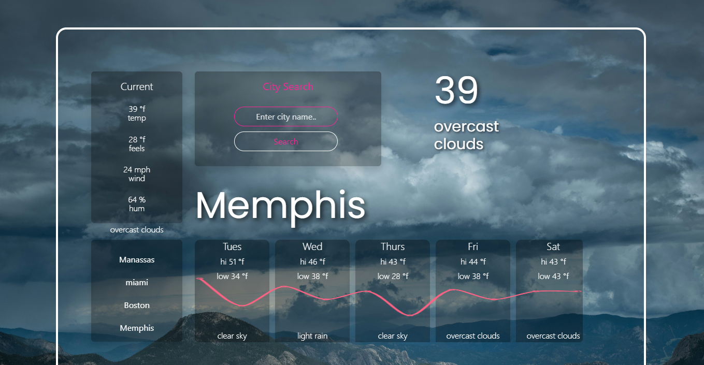

# Weather Forecast Application

## Table of Contents

- [Project Overview](#project-overview)
- [Features](#features)
- [Installation](#installation)
- [Usage](#usage)
- [Technologies Used](#technologies-used)
- [API Reference](#api-reference)
- [Contributing](#contributing)
- [License](#license)

## Project Overview

This Weather Forecast Application provides users with real-time weather data for their selected city. Users can view the current weather, a 5-day forecast, and save frequently searched cities for easy access. The application is designed to be user-friendly, visually appealing and provide reliable weather data sourced from OpenWeatherMap.

## Features

City Search: Search for any city to get the current weather conditions and a 5-day forecast.

Saved Searches: Save cities for easy access, displayed in a dedicated sidebar.

Responsive Design: Works across different devices, ensuring a seamless experience for desktop and mobile users.

Real-Time Data: Displays temperature, humidity, wind speed, and general weather conditions.

## Installation

To run this application locally, follow these steps:

Clone the repository:

git clone https://github.com/S-Bolt/Weather-Forecast.git

Navigate to the project directory:

cd Weather-Forecast

## Usage

Search for a City: Type a city name into the search bar and click "Search" to view the current weather and forecast.

View Saved Searches: Click any saved city button to quickly view its weather data.

## Technologies Used

Frontend: HTML, CSS, JavaScript, Bootstrap, jQuery , Chart.js

API: OpenWeatherMap API for real-time weather data

## API Reference

The application uses the OpenWeatherMap API to fetch weather information. You will need an API key to use the weather services.

Geo API: Used to convert city names to geographical coordinates.

Weather API: Used to fetch current weather and 5-day forecast data based on coordinates.

## Contributing

Contributions are welcome! If you have suggestions or would like to improve this application, please follow these steps:

Fork the repository.

Create a new branch (git checkout -b feature/YourFeature).

Commit your changes (git commit -m 'Add your feature').

Push to the branch (git push origin feature/YourFeature).

Open a Pull Request.

## License

This project is licensed under the MIT License. See the LICENSE file for details.