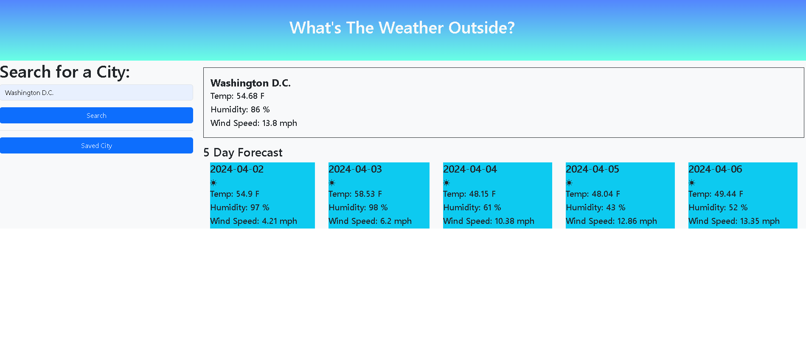

# Weather Forecast Display
    Hi!  Curious what the weather is doing outside and the next few days?  

## Description
    The weather dislpaly allows you to search the weather of cities.  It displays the current weather conditions and the 5 day forecast.

## Features
    -Search for weather data by city name.
    -Present current weather conditions
    -Temperature, wind, humidity
    -Present 5 day forecast for city
    -Saves search history presented on the left column(did not accomplish)
    
    
## Usage
You can us this great tool here: https://s-bolt.github.io/Weather-Forecast/

## License

 This project is licensed under the MIT License. Feel free to use, modify, and distribute the code for personal or commercial projects.